<h1>Программирование и алгоритмизация(Лабораторные работы)</h1>

<h1>Лабораторная работа №10</h1>

<h3>Краткая теория:</h3>

Stack - это структура данных, где элементы добавляются и удаляются только с одного конца (как стопка тарелок или книг).

Queue - это структура данных, где элементы добавляются с одного конца, а удаляются с другого.

Linked List - это цепочка элементов, где каждый элемент (узел) знает только о следующем элементе в цепочке (как вагоны поезда).

<h3>Задание 1:</h3>

```python
from collections import deque


class Stack:
    def __init__(self):
        self._data = []

    def push(self, item):
        self._data.append(item)

    def pop(self):
        if not self._data:
            raise IndexError()
        return self._data.pop()

    def peek(self):
        if not self._data:
            return None
        return self._data[-1]

    def is_empty(self):
        return len(self._data) == 0

    def __len__(self):
        return len(self._data)


class Queue:
    def __init__(self):
        self._data = deque()

    def enqueue(self, item):
        self._data.append(item)

    def dequeue(self):
        if not self._data:
            raise IndexError()
        return self._data.popleft()

    def peek(self):
        if not self._data:
            return None
        return self._data[0]

    def is_empty(self):
        return len(self._data) == 0

    def __len__(self):
        return len(self._data)

if __name__=="__main__":
    s = Stack()

    print("Stack tests:")
    print("Is empty:", s.is_empty()) 

    s.push(10)
    s.push(20)
    s.push(30)

    print("Peek:", s.peek())  
    print("Pop:", s.pop())   
    print("Pop:", s.pop())  
    print("Len:", len(s))  # 1
    print("Is empty:", s.is_empty())  


    q = Queue()

    print("Queue tests:")
    print("Is empty:", q.is_empty())  

    q.enqueue("a")
    q.enqueue("b")
    q.enqueue("c")

    print("Peek:", q.peek())  
    print("Dequeue:", q.dequeue())  
    print("Dequeue:", q.dequeue())  
    print("Len:", len(q))  
    print("Is empty:", q.is_empty())  
```

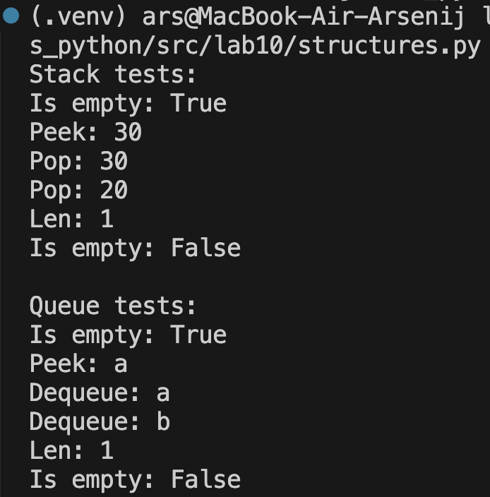


<h3>Задание 2:</h3>

```python
class Node:
    def __init__(self, value, next=None):
        self.value = value
        self.next = next


class SinglyLinkedList:
    def __init__(self):
        self.head = None
        self.tail = None 
        self._size = 0

    def append(self, value):
        new_node = Node(value)
        if self.head is None:
            self.head = new_node
            self.tail = new_node
        else:
            self.tail.next = new_node
            self.tail = new_node

        self._size += 1
    
    def prepend(self, value):
        new_node = Node(value, next=self.head)
        self.head = new_node
        if self.tail is None:
            self.tail = new_node
        self._size += 1

    def insert(self, idx, value):
        if idx < 0 or idx > self._size:
            raise IndexError()

        if idx == 0:
            self.prepend(value)
            return

        if idx == self._size:
            self.append(value)
            return

        current = self.head
        for _ in range(idx - 1):
            current = current.next

        new_node = Node(value, current.next)
        current.next = new_node
        self._size += 1

    def remove_at(self, idx):
        if idx < 0 or idx >= self._size:
            raise IndexError()

        if idx == 0:
            removed = self.head
            self.head = self.head.next
            if self.head is None:
                self.tail = None
            self._size -= 1
            return removed.value

        current = self.head
        for _ in range(idx - 1):
            current = current.next

        removed = current.next
        current.next = removed.next

        if removed is self.tail:
            self.tail = current

        self._size -= 1
        return removed.value

    def __iter__(self):
        current = self.head
        while current is not None:
            yield current.value
            current = current.next

    def __len__(self):
        return self._size

    def __repr__(self):
        values = list(self)
        return f"SinglyLinkedList({values})"

if __name__=="__main__":
    print("Тесты SinglyLinkedList")

    l = SinglyLinkedList()

    l.append(1)
    l.append(2)
    l.append(3)
    print("После append:", list(l)) 

    l.prepend(0)
    print("После prepend:", list(l))  

    l.insert(2, 99)
    print("После insert:", list(l))
    
    removed = l.remove_at(3)
    print("remove_at(3) вернул:", removed)  
    print("После remove_at:", list(l))  
    print("len:", len(l))
    print("repr:", repr(l))
```

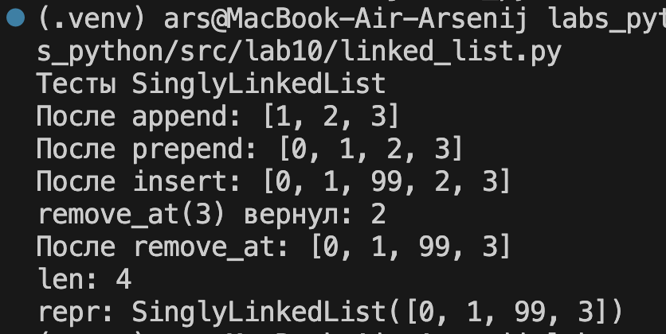

<h1>Лабораторная работа №9</h1>

<h3>Задание 1:</h3>

```python
import csv
from pathlib import Path
import sys

sys.path.append('/Users/ars/Documents/GitHub/labs_python/src/lab08/')
from models import Student

class Group:
    HEADER = ["fio", "birthdate", "group", "gpa"]

    def __init__(self, storage_path):
        self.path = Path(storage_path)
        self._ensure_storage_exists()

    def _ensure_storage_exists(self):
        if not self.path.exists() or self.path.stat().st_size == 0:
            with self.path.open("w", encoding="utf-8", newline="") as f:
                writer = csv.writer(f)
                writer.writerow(self.HEADER)

    def _read_all(self):
        rows = []
        with self.path.open("r", encoding="utf-8", newline="") as f:
            reader = csv.DictReader(f)
            if reader.fieldnames != self.HEADER:
                raise ValueError()
            for row in reader:
                Student(**row)  
                rows.append(row)
        return rows

    def _write_all(self, rows):
        with self.path.open("w", encoding="utf-8", newline="") as f:
            writer = csv.DictWriter(f, fieldnames=self.HEADER)
            writer.writeheader()
            writer.writerows(rows)

    def is_empty(self):
        return len(self._read_all()) == 0

    def list(self):
        rows = self._read_all()
        return [Student(**r) for r in rows]

    def add(self, student):
        rows = self._read_all()
        rows.append({
            "fio": student.fio,
            "birthdate": student.birthdate,
            "group": student.group,
            "gpa": str(student.gpa)
        })
        self._write_all(rows)

    def find(self, substr):
        substr = substr.lower()
        rows = self._read_all()
        return [Student(**r) for r in rows if substr in r["fio"].lower()]

    def remove(self, fio):
        rows = self._read_all()
        new_rows = [r for r in rows if r["fio"] != fio]
        self._write_all(new_rows)

    def update(self, fio, **fields):
        rows = self._read_all()
        for r in rows:
            if r["fio"] == fio:
                for k, v in fields.items():
                    if k in self.HEADER:
                        r[k] = v
                Student(**r)  
        self._write_all(rows)

    def stats(self):
        rows = self._read_all()
        if not rows:
            return {"count": 0, "average_gpa": 0, "top_5_students": []}
        gpas = [float(r["gpa"]) for r in rows]
        sorted_rows = sorted(rows, key=lambda x: float(x["gpa"]), reverse=True)
        return {
            "count": len(rows),
            "average_gpa": round(sum(gpas) / len(gpas), 2),
            "top_5_students": sorted_rows[:5]
        }
```
До запуска кода

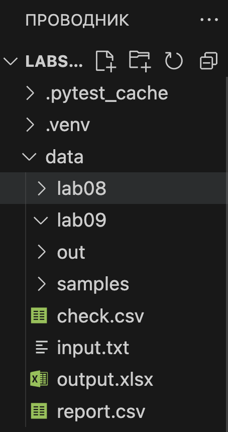

После запуска кода

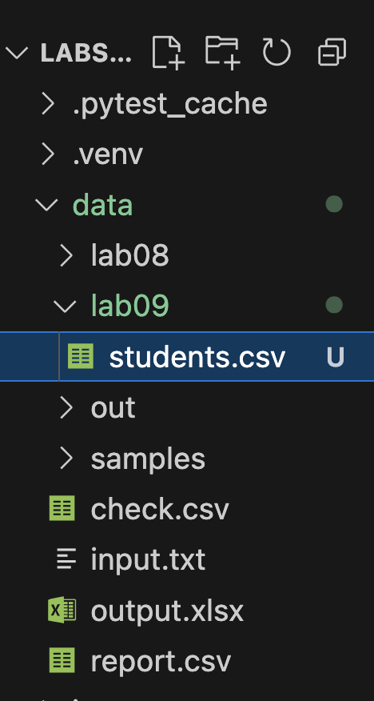

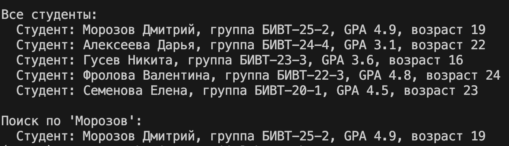


<h3>Обновление студентов:</h3>

```python
# Обновление
group.update("Морозов Дмитрий", gpa=4.7, group="БИВТ-19-2")
print(f"\nПосле обновления Морозова: {group.find('Морозов Дмитрий')[0]}")
```


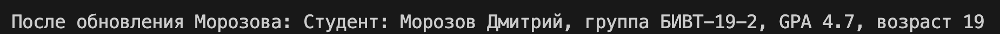
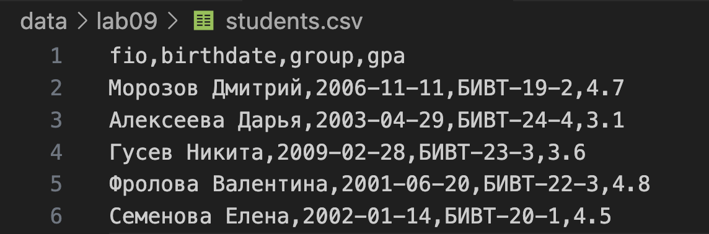


<h3>Удаление студентов:</h3>

```python
# Удаление 
group.remove("Семенова Елена")
print(f"\nПосле удаления Семеновой, всего студентов: {len(group.list())}")
```


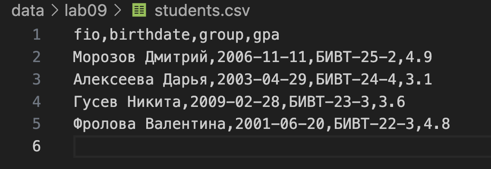


<h1>Лабораторная работа №8</h1>

<h3>Задание 1:</h3>

```python
from dataclasses import dataclass
from datetime import datetime, date


@dataclass
class Student:
    fio: str
    birthdate: str
    group: str
    gpa: float

    def __post_init__(self):
        try:
            datetime.strptime(self.birthdate, "%Y-%m-%d")
        except ValueError:
            raise ValueError("birthdate must be in format YYYY-MM-DD")
        self.gpa = float(self.gpa)
        if not (0 <= self.gpa <= 5):
            raise ValueError(f"GPA должен быть от 0 до 5, получено {self.gpa}")

    # Возраст
    def age(self):
        b = datetime.strptime(self.birthdate, "%Y-%m-%d").date()
        today = date.today()
        years = today.year - b.year
        if (today.month, today.day) < (b.month, b.day):
            years -= 1
        return years

    # Сериализация
    def to_dict(self):
        return {
            "fio": self.fio,
            "birthdate": self.birthdate,
            "group": self.group,
            "gpa": self.gpa,
        }

    # Десериализация
    @classmethod
    def from_dict(cls, d):
        return cls(
            fio=d["fio"],
            birthdate=d["birthdate"],
            group=d["group"],
            gpa=float(d["gpa"]),  
        )

    def __str__(self):
        return f"Студент: {self.fio}, группа {self.group}, GPA {self.gpa}, возраст {self.age()}"

s = Student(fio="Иванов Петр", birthdate="2007-10-19", group="BIVT-25-8", gpa=4.8)
print(f"Возраст: {s.age()}")
print(f"{s.to_dict()}")
s.from_dict(s.to_dict())
print(f"{s.__str__()}")
```

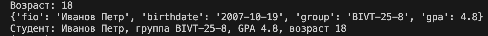


<h3>Задание 2:</h3>

```python
import json
from models import Student
from pathlib import Path
import sys
import os
sys.path.append('/Users/ars/Documents/GitHub/labs_python/src/lab08/')

from models import *

students=[Student(fio="Иванов Петр", birthdate="2007-10-19", group="BIVT-25-8", gpa=4.8),
          Student(fio="Петров Иван", birthdate="2006-09-28", group="BIVT-25-12", gpa=4.6),]

def students_to_json(students, path):
    data = [s.to_dict() for s in students]
    with open(path, "w", encoding="utf-8") as f:
        json.dump(data, f, ensure_ascii=False, indent=2)

def students_from_json(path) -> list[Student]:
    with open(path, "r", encoding="utf-8") as f:
        data = json.load(f)

    if not isinstance(data, list):
        raise ValueError()

    students = []
    for item in data:
        if not isinstance(item, dict):
            raise ValueError()
        required = ["fio", "birthdate", "group", "gpa"]
        for key in required:
            if key not in item:
                raise ValueError()
        students.append(Student.from_dict(item))
    return students

base_dir = Path("/Users/ars/Documents/GitHub/labs_python")
json_path = base_dir / "data" / "lab08" / "students_input.json"

students_to_json(students, json_path)
print(students_from_json(json_path))
```

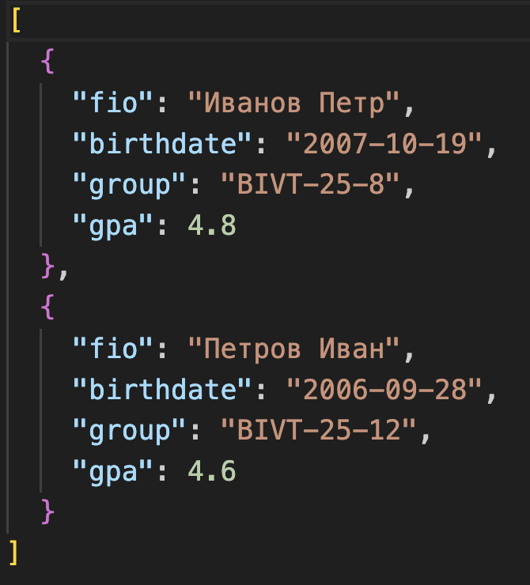


<h1>Лабораторная работа №7</h1>

<h3>Задание A:</h3>

```python
import pytest
import sys
import os

sys.path.append("/Users/ars/Documents/GitHub/labs_python/src/lib/")
from text import *

# normalize


@pytest.mark.parametrize(
    "text, expected",
    [
        ("ПрИвЕт\nМИр\t", "привет мир"),
        ("ёжик, Ёлка", "ежик, елка"),
        ("Hello\r\nWorld", "hello world"),
        ("  двойные   пробелы  ", "двойные пробелы"),
        ("", ""),
    ],
)
def test_normalize(text, expected):
    assert normalize(text) == expected


# tokenize


@pytest.mark.parametrize(
    "text, expected",
    [
        ("привет мир", ["привет", "мир"]),
        ("hello,world!!!", ["hello", "world"]),
        ("по-настоящему круто", ["по-настоящему", "круто"]),
        ("2025 год", ["2025", "год"]),
        ("emoji 😀 не слово", ["emoji", "не", "слово"]),
        ("", []),
    ],
)
def test_tokenize(text, expected):
    assert tokenize(text) == expected


# count_freq


@pytest.mark.parametrize(
    "tokens, expected",
    [
        (["a", "b", "a", "c", "b", "a"], {"a": 3, "b": 2, "c": 1}),
        (["bb", "aa", "bb", "aa", "cc"], {"aa": 2, "bb": 2, "cc": 1}),
        ([], {}),
    ],
)
def test_count_freq(tokens, expected):
    assert count_freq(tokens) == expected


# top_n


@pytest.mark.parametrize(
    "freq, n, expected",
    [
        ({"a": 3, "b": 2, "c": 1}, 2, [("a", 3), ("b", 2)]),
        ({"aa": 2, "bb": 2, "cc": 1}, 2, [("aa", 2), ("bb", 2)]),
        ({}, 5, []),
        ({"a": 3}, 0, []),
        ({"a": 3, "b": 2}, 10, [("a", 3), ("b", 2)]),
    ],
)
def test_top_n(freq, n, expected):
    assert top_n(freq, n) == expected
```
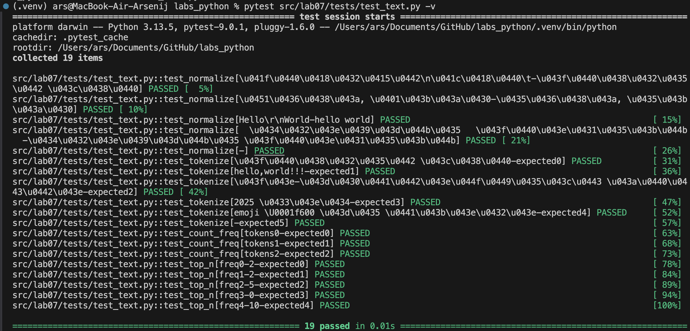

<h3>Задание B:</h3>

```python
import pytest
import json
import csv
import sys
from pathlib import Path

sys.path.append("/Users/ars/Documents/GitHub/labs_python/src/lab05/")
from json_csv import *
from csv_xlsx import *

# Позитивные сценарии


def test_json_to_csv_positive(tmp_path: Path):
    src = tmp_path / "input.json"
    dst = tmp_path / "output.csv"
    data = [
        {"name": "Alice", "age": 22},
        {"name": "Bob", "age": 25},
    ]
    src.write_text(json.dumps(data, ensure_ascii=False, indent=2), encoding="utf-8")
    json_to_csv(str(src), str(dst))
    with dst.open(encoding="utf-8") as f:
        rows = list(csv.DictReader(f))
    assert len(rows) == 2
    assert set(rows[0].keys()) == {"name", "age"}
    assert rows[0]["name"] == "Alice"


def test_csv_to_json_positive(tmp_path: Path):
    src = tmp_path / "input.csv"
    dst = tmp_path / "output.json"
    with src.open("w", encoding="utf-8", newline="") as f:
        writer = csv.DictWriter(f, fieldnames=["name", "age"])
        writer.writeheader()
        writer.writerow({"name": "Alice", "age": "22"})
        writer.writerow({"name": "Bob", "age": "25"})
    csv_to_json(str(src), str(dst))
    result = json.loads(dst.read_text(encoding="utf-8"))
    assert len(result) == 2
    assert set(result[0].keys()) == {"name", "age"}
    assert result[1]["name"] == "Bob"


# Негативные сценарии


@pytest.mark.parametrize(
    "case",
    [
        (json_to_csv, "json", "", ValueError),
        (csv_to_json, "csv", "", ValueError),
        (json_to_csv, "json", None, FileNotFoundError),
        (csv_to_json, "csv", None, FileNotFoundError),
    ]
)
def test_negative_cases(tmp_path: Path, case):
    converter, ext, content, exc = case
    src = tmp_path / f"bad.{ext}"
    dst = tmp_path / "out.tmp"
    if content is not None:
        src.write_text(content, encoding="utf-8")
    with pytest.raises(exc):
        converter(str(src), str(dst))
```
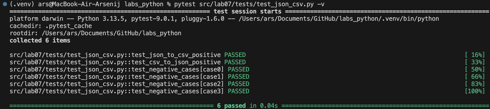

<h3>Задание C:</h3>

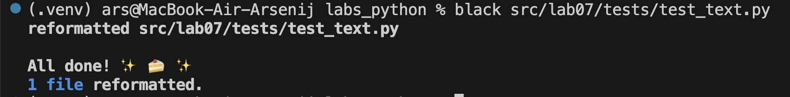


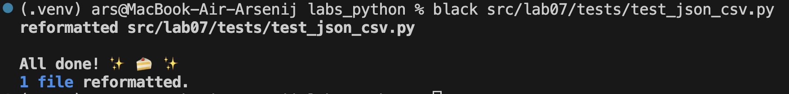


<h1>Лабораторная работа №6</h1>

<h3>Задание №1:</h3>

```python
import argparse
import sys
import os


sys.path.append('/Users/ars/Documents/GitHub/labs_python/src/lib/')

from text import*


def cat(input_path, number_lines):
    with open(input_path, 'r', encoding='utf-8') as file:
        for i, line in enumerate(file, 1):
            if number_lines:
                print(f"{i}:{line}", end='')


def stats(input_text, n=5):
    with open(input_text, 'r', encoding='utf-8') as f:
        text = f.read()

    tokens = tokenize(normalize(text))
    freq = count_freq(tokens)
    top_words = top_n(freq, n)

    for word, count in top_words:
        print(f"{word}: {count}")


def main():
    parser = argparse.ArgumentParser(description="CLI-утилиты лабораторной №6")
    subparsers = parser.add_subparsers(dest="command")

    # Подкоманда cat
    cat_parser = subparsers.add_parser("cat", help="Вывести содержимое файла")
    cat_parser.add_argument("--input", required=True, help="Путь к файлу")
    cat_parser.add_argument("-n", action="store_true", help="Нумеровать строки")

    # Подкоманда stats
    stats_parser = subparsers.add_parser("stats", help="Частоты слов в тексте")
    stats_parser.add_argument("--input", required=True, help="Путь к текстовому файлу")
    stats_parser.add_argument("--top", type=int, default=5, help="Количество слов в топе")

    args = parser.parse_args()

    if args.command == "cat":
        cat(args.input, args.n)
    if args.command == "stats":
        stats(args.input, args.top)


if __name__ == "__main__":
    main()
```
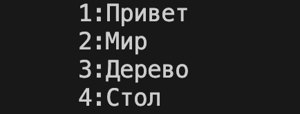
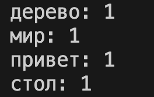

<h3>Задание №2:</h3>

```python
import argparse
import sys
import os
sys.path.append('/Users/ars/Documents/GitHub/labs_python/src/lab05/')

from json_csv import*
from csv_xlsx import*

def json2csv(input_file, output_file):
    json_to_csv(input_file, output_file)

def csv2json(input_file, output_file):
    csv_to_json(input_file, output_file)

def csv2xlsx(input_file, output_file):
    csv_to_xlsx(input_file, output_file)

def main():
    parser = argparse.ArgumentParser(description="Конвертеры данных")
    sub = parser.add_subparsers(dest="cmd")

    p1 = sub.add_parser("json2csv")
    p1.add_argument("--in", dest="input", required=True)
    p1.add_argument("--out", dest="output", required=True)

    p2 = sub.add_parser("csv2json")
    p2.add_argument("--in", dest="input", required=True)
    p2.add_argument("--out", dest="output", required=True)

    p3 = sub.add_parser("csv2xlsx")
    p3.add_argument("--in", dest="input", required=True)
    p3.add_argument("--out", dest="output", required=True)

    args = parser.parse_args()

    if args.cmd == "json2csv":
        json2csv(args.input, args.output)
    elif args.cmd == "csv2json":
        csv2json(args.input, args.output)
    elif args.cmd == "csv2xlsx":
        csv2xlsx(args.input, args.output)
if __name__ == "__main__":
    main()
```
json to csv

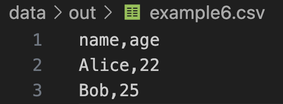

csv to json

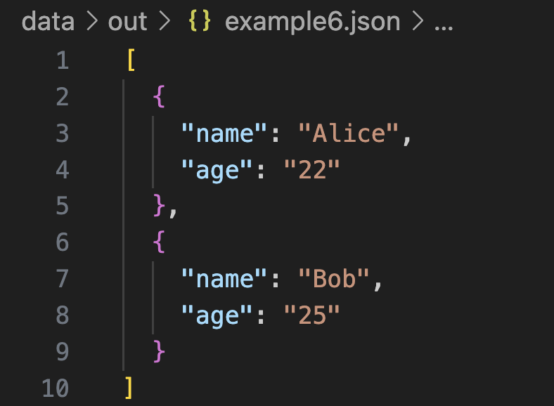

csv to xlsx

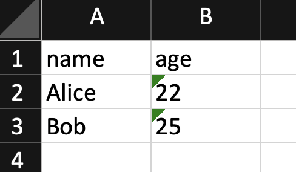

<h1>Лабораторная работа №5</h1>

<h3>Задание №1:</h3>

```python
import json
import csv
from pathlib import*

def json_to_csv(json_path: str, csv_path: str) -> None:
    json_file = Path(json_path)
    if not json_file.exists():
        raise FileNotFoundError
    
    if json_file.suffix.lower() != '.json':
        raise ValueError
    
    with open(json_path, 'r', encoding='utf-8') as f:
        data = json.load(f)
    
    if not data:
        raise ValueError
    
    fieldnames = list(data[0].keys())
    
    with open(csv_path, 'w', encoding='utf-8', newline='') as f:
        writer = csv.DictWriter(f, fieldnames=fieldnames)
        writer.writeheader()
        for row in data:
            writer.writerow({field: str(row.get(field, '')) for field in fieldnames})
json_to_csv(f"data/samples/people_1.json", f"data/samples/people_1.csv")


def csv_to_json(csv_path: str, json_path: str) -> None:
    csv_file = Path(csv_path)
    if not csv_file.exists():
        raise FileNotFoundError
    
    if csv_file.suffix.lower() != '.csv':
        raise ValueError
    
    with open(csv_path, 'r', encoding='utf-8') as f:
        reader = csv.DictReader(f)
        data = list(reader)
    
    if not data:
        raise ValueError
    
    with open(json_path, 'w', encoding='utf-8') as f:
        json.dump(data, f, ensure_ascii=False, indent=2)
csv_to_json(f"data/samples/people.csv",f"data/samples/people.json")
```
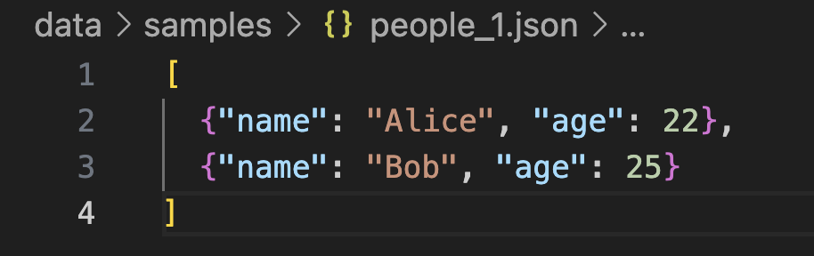

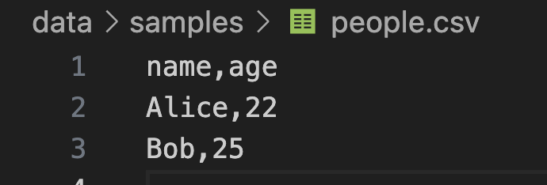
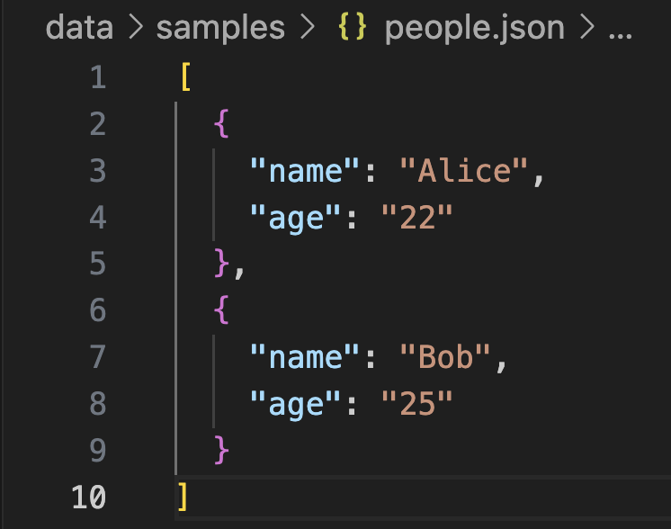

<h3>Задание №2:</h3>

```python
import csv
import os
from openpyxl import Workbook
from openpyxl.utils import*


def csv_to_xlsx(csv_path: str, xlsx_path: str) -> None:
    if not os.path.exists(csv_path):
        raise FileNotFoundError(f"Файл не найден: {csv_path}")
    
    if not csv_path.lower().endswith('.csv'):
        raise ValueError("Входной файл должен иметь расширение .csv")
    
    if not xlsx_path.lower().endswith(".xlsx"):
        raise ValueError("Выходной файл должен иметь расширение .xlsx")
    
    with open(csv_path, 'r', encoding='utf-8') as f:
        reader = csv.reader(f)
        rows = list(reader)
    
    if not rows:
        raise ValueError("CSV-файл пуст")

    wb = Workbook()
    ws = wb.active
    ws.title = "Sheet1"

    for row in rows:
        ws.append(row)

    for i, col in enumerate(ws.columns, start=1):
        max_length = 0
        for cell in col:
            if cell.value:
                max_length = max(max_length, len(str(cell.value)))
        ws.column_dimensions[get_column_letter(i)].width = max(max_length, 8)

    wb.save(xlsx_path)
csv_to_xlsx("data/samples/peeople_2.csv", "data/output.xlsx")
```
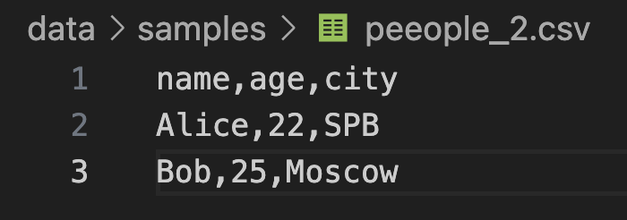
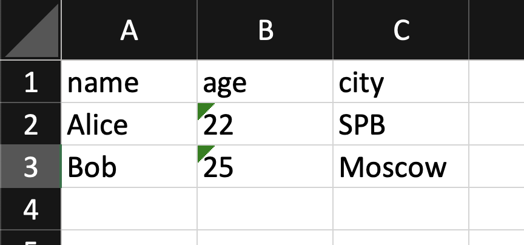


<h1>Лабораторная работа №4</h1>

<h3>Задание №1:</h3>

```python
from pathlib import*
import csv
from typing import Iterable, Sequence
import sys
import os

sys.path.append('/Users/ars/Documents/GitHub/labs_python/src/lib/')
from text import *

def read_text(path: str | Path, encoding: str = "utf-8") -> str:
    path = Path(path)
    if not path.exists():
        raise FileNotFoundError
    try:
        text=path.read_text(encoding=encoding)
        text=normalize(text)
        return text
    except UnicodeDecodeError as a:
        raise UnicodeDecodeError() from a

def write_csv(rows: list[tuple | list], path: str | Path, header: tuple[str, ...] | None = None) -> None:
    if rows:
        for row in rows:
            if len(row)!=len(rows[0]):
                raise ValueError
    if header and rows and len(header)!=len(rows[0]):
        raise ValueError
    p = Path(path)
    rows = list(rows)
    with p.open("w", newline="", encoding="utf-8") as f:
        w = csv.writer(f)
        if header is not None:
            w.writerow(header)
        for r in rows:
            w.writerow(r)
            
write_csv([("word","count"),("test",3)], "data/check.csv")  
txt = read_text("data/input.txt") 
print(txt)
```
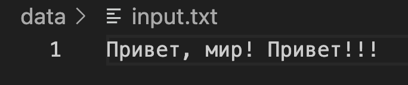
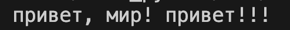
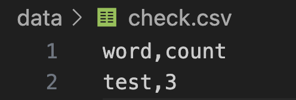

<h3>Задание №2:</h3>

```python
import sys
import os
import csv
from collections import Counter

sys.path.append('/Users/ars/Documents/GitHub/labs_python/src/lib/')
from text import *

def main():
    input_file="data/input.txt"
    output_file="data/report.csv"
    encoding="utf-8"
    with open(input_file, 'r', encoding=encoding) as f:
        text=f.read()
    text=normalize(text)
    words=tokenize(text)
    word_count=Counter(words)
    sorted_words=sorted(word_count.items(), key=lambda x: (-x[1], x[0]))
    with open(output_file, 'w', encoding='utf-8') as f:
        f.write("word,count\n")
        for word, count in sorted_words:
            f.write(f"{word},{count}\n")
    print(f"Всего слов: {len(words)}")
    print(f"Уникальных слов: {len(word_count)}")
    print("Топ-5:")
    for word, count in sorted_words[:5]:
        print(f"{word}:{count}")
main()
```

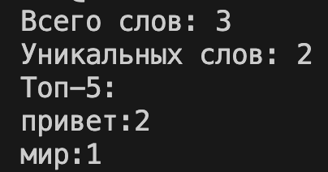
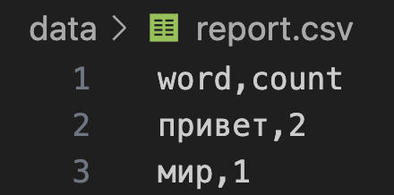

<h1>Лабораторная работа №3</h1>

<h3>Задание №1:</h3>

```python
import re

def normalize(text: str, *, casefold: bool = True, yo2e: bool = True) -> str:
    if yo2e:
        text=text.replace('ё', 'е').replace('Ё', 'Е')
    text=re.sub(r'\s', ' ', text)
    text=re.sub(r' +', ' ', text).strip()
    if casefold:
        text=text.casefold()
    return text
    
def tokenize(text: str) -> list[str]:
    pattern=r'[\w]+(?:-[\w]+)*'
    tokens=re.findall(pattern, text)
    return tokens

def count_freq(tokens: list[str]) -> dict[str, int]:
    freq_dict={}
    for token in tokens:
        if token in freq_dict:
            freq_dict[token] += 1
        else:
            freq_dict[token] = 1
    return freq_dict

def top_n(freq: dict[str, int], n: int = 5) -> list[tuple[str, int]]:
    sorted_items = sorted(freq.items(), key=lambda x: (-x[1], x[0]))
    return sorted_items[:n]
```
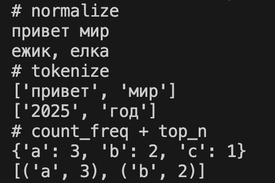

<h3>Задание №2:</h3>

```python
import sys
import os

sys.path.append('/Users/ars/Documents/GitHub/labs_python/src/lib/')
from text import *

def phrase():
    fraza=sys.stdin.readline().strip()
    if not fraza:
        print('Ввода нет')
    normalize_fraza=normalize(fraza)
    tokens=tokenize(normalize_fraza)
    freq_count=count_freq(tokens)
    most_usable_words=top_n(freq_count,5)
    total_words=len(tokens)
    unique_words=len(freq_count)
    print(f'Всего слов:{total_words}')
    print(f'Уникальных слов:{unique_words}')
    print('Топ-5:')
    for words,counts in most_usable_words:
        print(f'{words}:{counts}')
    
phrase()
```
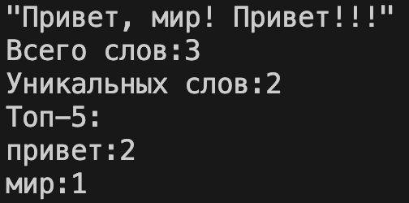


<h1>Лабораторная работа №2</h1>

<h3>Задание №1:</h3>

```python
def min_max(maxx_minn):
    if len(maxx_minn)!=0:
        return tuple([min(maxx_minn), max(maxx_minn)])
    else:
        raise ValueError
print('min_max')
print(min_max([3, -1, 5, 5, 0]))
print(min_max([42]))
print(min_max([-5, -2, -9]))

print(min_max([1.5, 2, 2.0, -3.1]))
 
def unique_sorted(el):
    el=list(set(el))
    el=sorted(el)
    return el
print('unique_sorted')
print(unique_sorted([3, 1, 2, 1, 3]))
print(unique_sorted([]))
print(unique_sorted([-1, -1, 0, 2, 2]))
print(unique_sorted([1.0, 1, 2.5, 2.5, 0]))

def flatten(flatten_el):
    result_flatten=[]
    for i in range(len(flatten_el)):
        if type(flatten_el[i]) in [list,tuple]:
            result_flatten+=flatten_el[i]
        else:
            raise TypeError
    return result_flatten
print('flatten')
print(flatten([[1, 2], [3, 4]]))
print(flatten([[1, 2], (3, 4, 5)]))
print(flatten([[1], [], [2, 3]]))
```

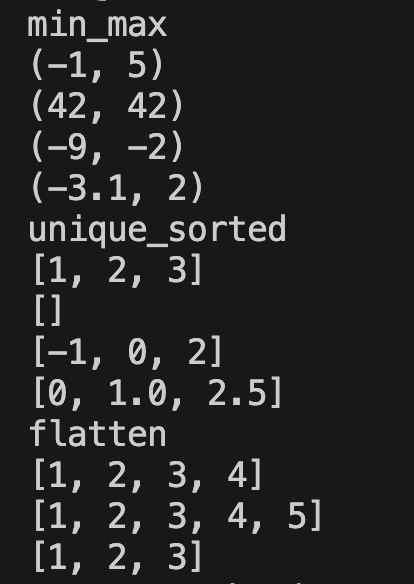

.png)

<h3>Задание №2:</h3>

```python
def transpose(matrix):
    if not matrix:
        return []
    
    for el_mat in matrix:
        if len(el_mat)!=len(matrix[0]):
            raise ValueError
        
    result=[]
    for i in range(len(matrix[0])):
        transposes=[]
        for j in range(len(matrix)):
            transposes.append(matrix[j][i])
        result.append(transposes)
    return result
print('transpose')
print(transpose([[1, 2, 3]]))
print(transpose([[1], [2], [3]]))
print(transpose([[1, 2], [3, 4]]))
print(transpose([]))


def row_sums(sum_matrix):
    if not sum_matrix:
        return []
    
    for el_mat in sum_matrix:
        if len(el_mat)!=len(sum_matrix[0]):
            raise ValueError
    
    summa=[]
    for el_mat in sum_matrix:
        el_sum = sum(el_mat)
        summa.append(el_sum)
    return summa
print('row_sums')
print(row_sums([[1, 2, 3], [4, 5, 6]]))
print(row_sums([[-1, 1], [10, -10]]))
print(row_sums([[0, 0], [0, 0]]))
print(row_sums([[0, 0], [0, 0]]))


def col_sums(col_matrix):
    if not col_matrix:
        return []
    
    for el_mat in col_matrix:
        if len(el_mat)!=len(col_matrix[0]):
            raise ValueError
    result=[]
    for i in range(len(col_matrix[0])):
        summ=0
        for j in range(len(col_matrix)):
            summ+=col_matrix[j][i]
        result.append(summ)
    return result
print('col_sums')
print(col_sums([[1, 2, 3], [4, 5, 6]]))
print(col_sums([[-1, 1], [10, -10]]))
print(col_sums([[0, 0], [0, 0]]))
print(col_sums([[1, 2], [3]]))
```

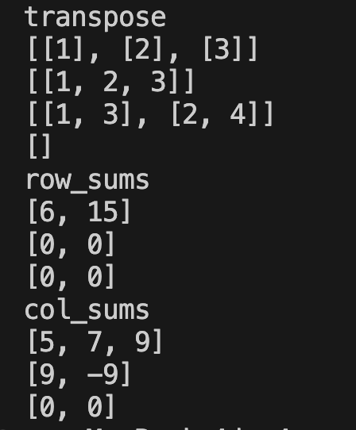

.png)

<h3>Задание №3:</h3>

```python
def format(tuple_inf):
    if len(tuple_inf)!=3:
        raise TypeError
    if type(tuple_inf[2])!=float:
        raise TypeError
    if type(tuple_inf[0])!=str:
        raise TypeError
    if type(tuple_inf[1])!=str:
        raise TypeError
    fio=tuple_inf[0].strip().split()
    gruppa=tuple_inf[1].strip()
    gpa=tuple_inf[2]
    fio_out=fio[0].capitalize()+' '
    if not fio:
        raise ValueError
    if not gruppa:
        raise ValueError
    if gpa<0:
        raise ValueError
    for i in range(1,len(fio)):
        fio_out+=fio[i][0].upper()+'.'
    print(fio_out+','+ f' гр. {tuple_inf[1]}',f'GPA {tuple_inf[2]:.2f}')
format(('Иванов Иван Иванович','BIVT-25',4.6))
format(("Петров Пётр", "IKBO-12", 5.0))
format(("Петров Пётр Петрович", "IKBO-12", 5.0))
format(("  сидорова  анна   сергеевна ", "ABB-01", 3.999))
```

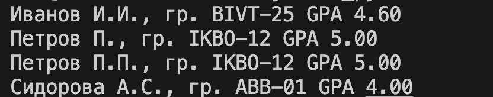

<h2>Лабораторная №1:</h2>

<h3>Задание №1:</h3>

```python
name=input()
vozrast=int(input())
vozrast_1=vozrast+1
print('Имя:',name)
print('Возраст:',vozrast)
print(f'Привет, {name}!',f'Через год тебе будет {vozrast_1}.')
```

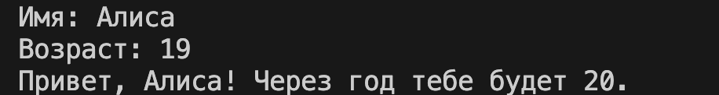

<h3>Задание №2:</h3>

```python
a=input('a: ')
b=input('b: ')
a=float(a.replace(',','.'))
b=float(b.replace(',','.'))
sum=a+b
avg=(a+b)/2
print(f'sum={sum:.2f};',f'avg={avg:.2f}')
```
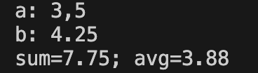


<h3>Задание №3:</h3>

```python
price=float(input())
discount=float(input())
vat=float(input())

base=price*(1 - discount/100)
vat_amount=base * (vat/100)
total=base+vat_amount
print('База после скидки:',  base,'₽')
print('НДС:',  vat_amount,'₽')
print('Итого к оплате:',  total,'₽')
```
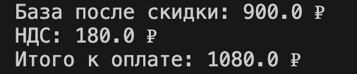

<h3>Задание №4:</h3>

```python
m=int(input())
print('Минуты:',m)
print(f'{(m//60):02d}:{(m%60):02d}')
```
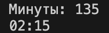

<h3>Задание №5:</h3>

```python
f,i,o=(input().split())
s=str(f)+str(i)+str(o)
print('ФИО:',f,i,o)
print(f'Инициалы: {f[0]+i[0]+o[0]}.')
print('Длина (символов):',len(s)+2)
```
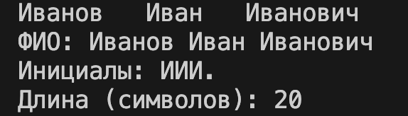

<h3>Задание №6:</h3>

```python
ochnoe_obychenie=0
zaochnoe_obychenie=0

for n in range(int(input())):
    data=input().split()
    format=data[-1]

    if format=='True':
        ochnoe_obychenie+=1

    if format=='False':
        zaochnoe_obychenie+=1

print('out:', ochnoe_obychenie, zaochnoe_obychenie)
```
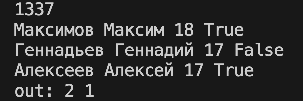

<h3>Задание №7:</h3>

```python
s=input('in: ')
for i in range(len(s)):
    if s[i] in 'ABCDEFGHIJKLMNOPQRSTUVWXYZ':
        first_mem=i
        break

for i in range(len(s)):
    if s[i] in '0123456789' and s[i+1] not in '0123456789':
        second_mem=i+1
        break

last_mem=s.find('.')

distance = second_mem - first_mem
stroka=[]
for i in range(first_mem,last_mem+1,distance):
    stroka.append(s[i])
print('out:',''.join(stroka))
```
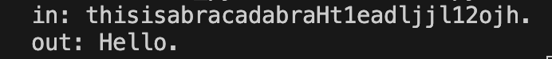


